<div align="center">

# PiDeck

**A native desktop app for [Pi Coding Agent](https://www.npmjs.com/package/@earendil-works/pi-coding-agent)**

Chat with your coding agent, watch its tools work, manage sessions, models, and packages — in one visual workspace.

[](https://github.com/Skitre/PiDeck/actions/workflows/p0.yml)
[](https://github.com/Skitre/PiDeck/releases)
[](#download)
[](./LICENSE)

[English](./README.md) | [简体中文](./README.zh-CN.md)

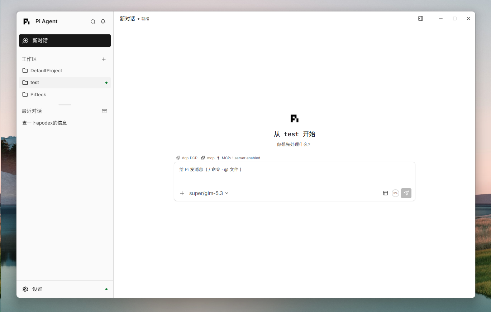

</div>

## Features

- **Streaming conversations** — watch the agent think, call tools, and stream results in real time, with one-click abort and automatic session recovery.
- **Sessions & workspaces** — browse, search, create, and reopen sessions across projects; conversation history is restored exactly where you left off.
- **Models & providers** — switch providers, models, and thinking levels from the UI, with usage visibility per conversation.
- **Git built in** — review changes, stage or unstage individual hunks, and browse branch history without leaving the app.
- **Workspace Dock** — inspect the project file tree, reference files in a prompt, open conversation links in embedded browser tabs, and keep terminals beside the chat.
- **Packages** — browse the pi.dev catalog, then install and manage user-scope Extensions, Skills, Prompts, and Themes.
- **Extension UI & terminal** — extensions render their own interactive panels, and an integrated workspace terminal is one shortcut away.
- **Make it yours** — PiDeck, Vercel, and Apple themes; customizable keyboard shortcuts and context menus; English and 简体中文.

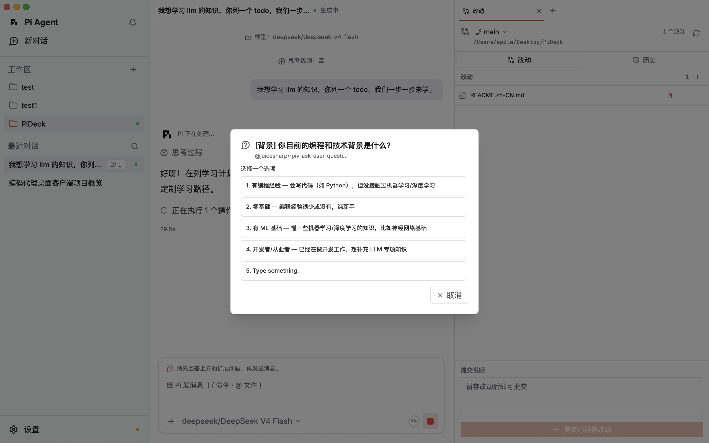

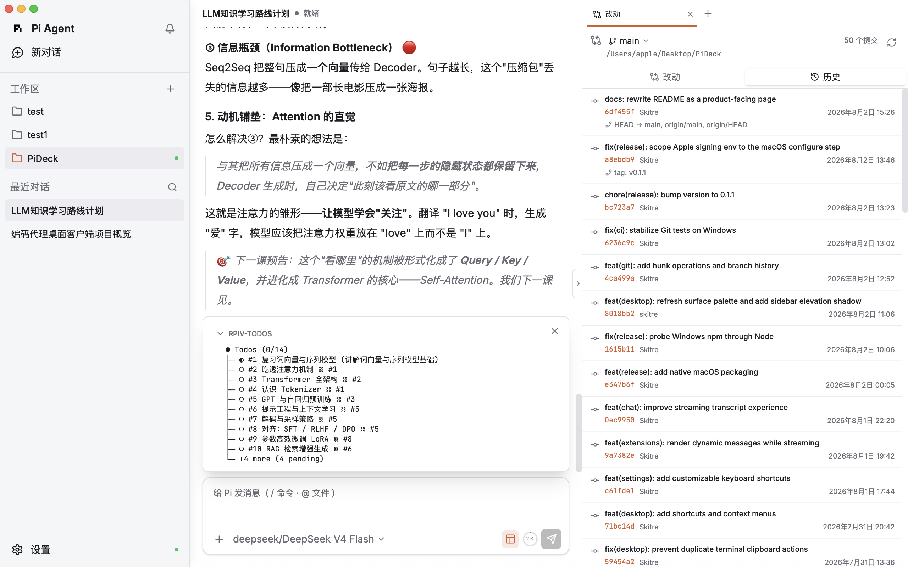

## Screenshots

<table>
  <tr>
    <td align="center" width="50%">
      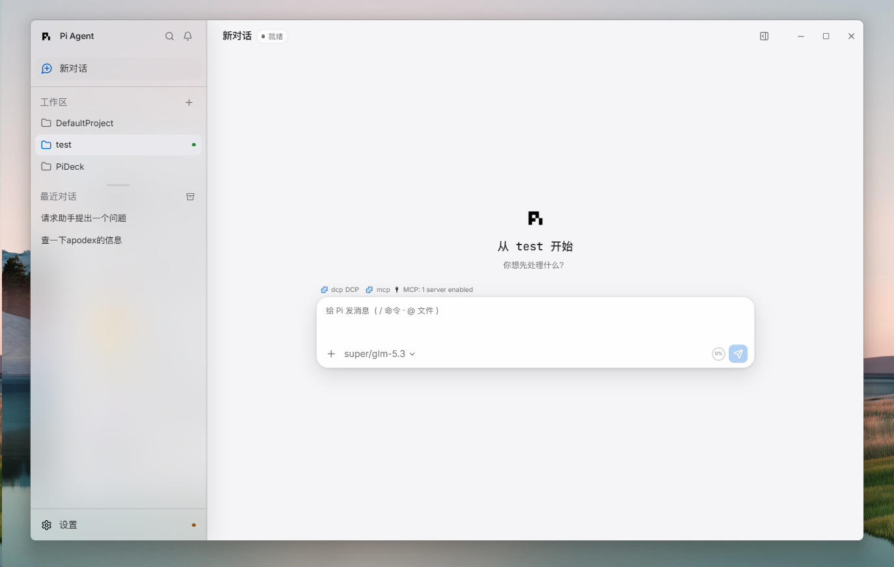
      <br><sub>Apple theme — workspaces</sub>
    </td>
    <td align="center" width="50%">
      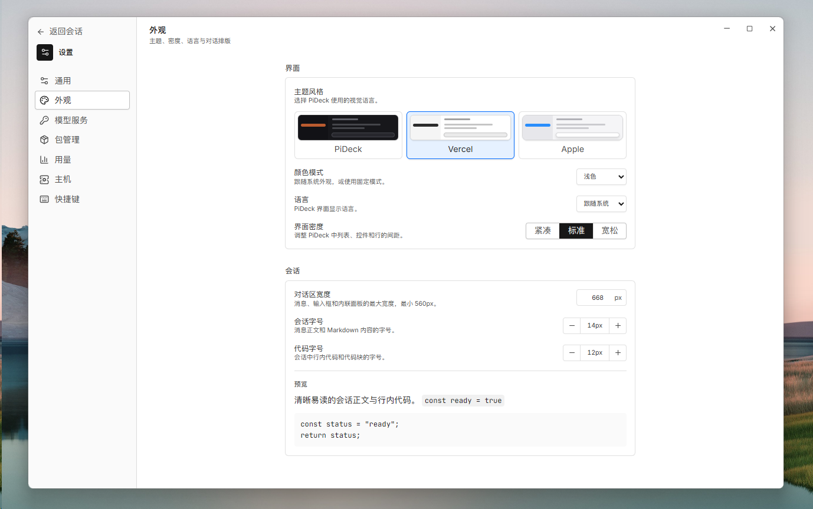
      <br><sub>Themes — PiDeck / Vercel / Apple</sub>
    </td>
  </tr>
  <tr>
    <td align="center" width="50%">
      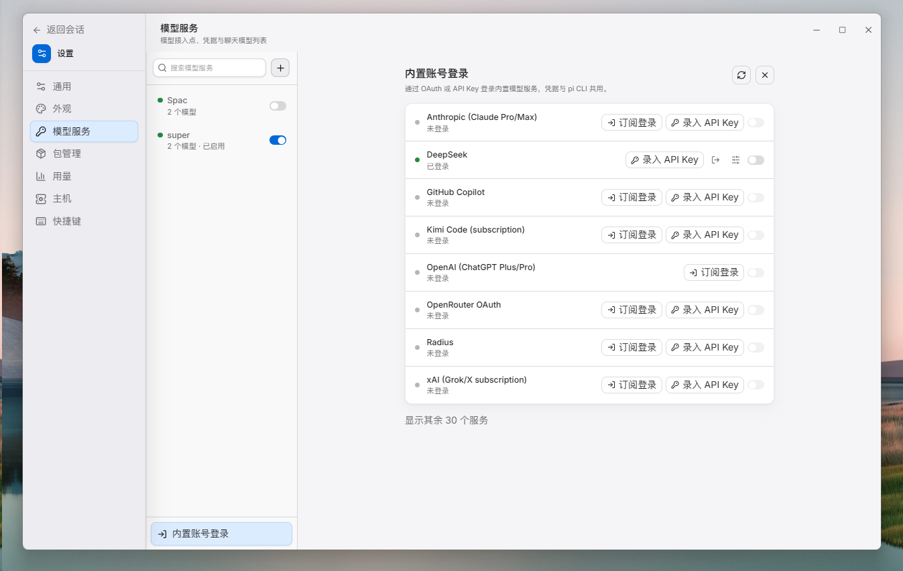
      <br><sub>Apple theme — model providers</sub>
    </td>
    <td align="center" width="50%">
      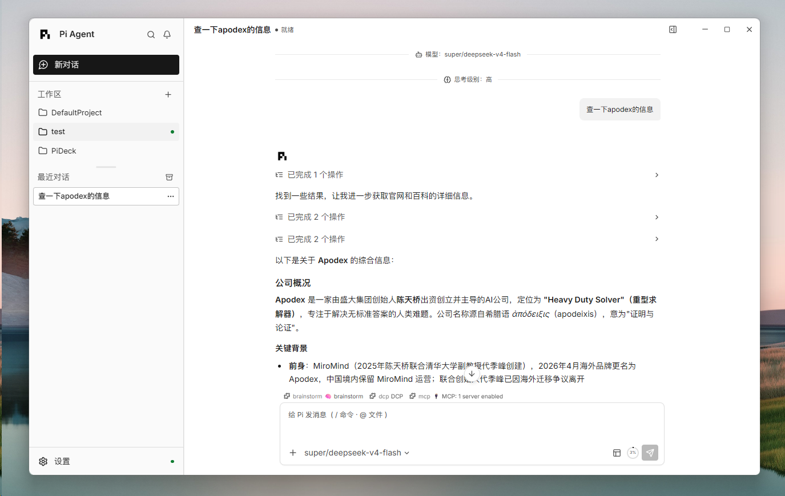
      <br><sub>Vercel — streaming replies and tools</sub>
    </td>
  </tr>
  <tr>
    <td align="center" width="50%">
      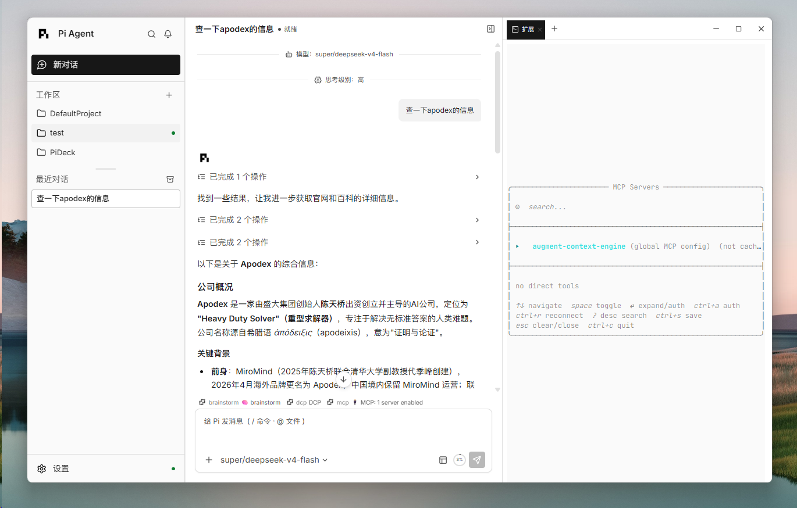
      <br><sub>Vercel — Workspace Dock / MCP</sub>
    </td>
    <td align="center" width="50%">
      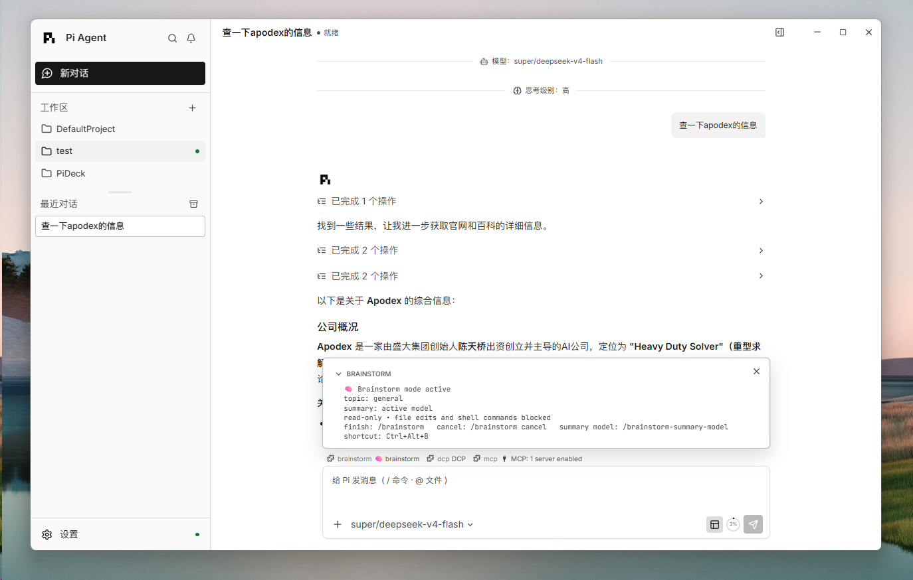
      <br><sub>Vercel — Brainstorm overlay</sub>
    </td>
  </tr>
  <tr>
    <td align="center" width="50%">
      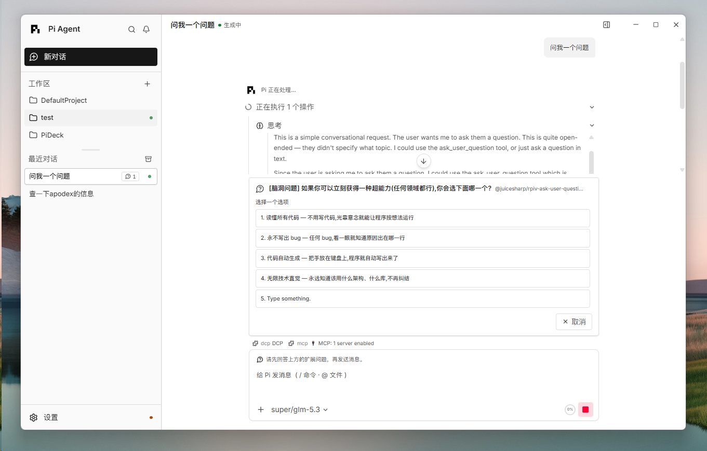
      <br><sub>Vercel — extension prompt</sub>
    </td>
    <td align="center" width="50%">
      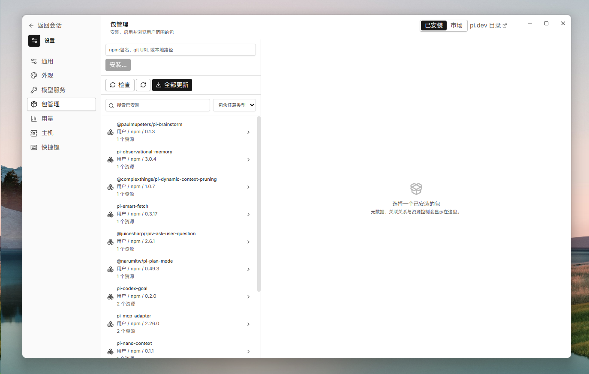
      <br><sub>Packages — Installed</sub>
    </td>
  </tr>
  <tr>
    <td align="center" width="50%">
      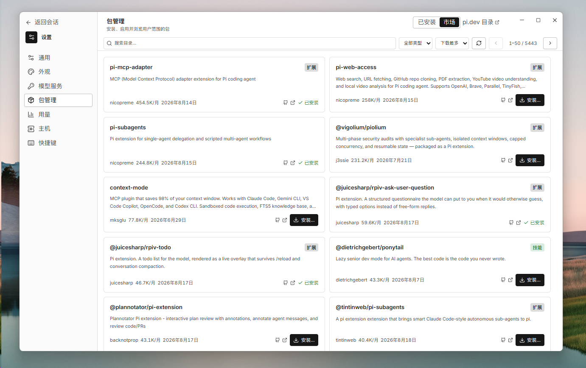
      <br><sub>Packages — Market</sub>
    </td>
    <td align="center" width="50%">
      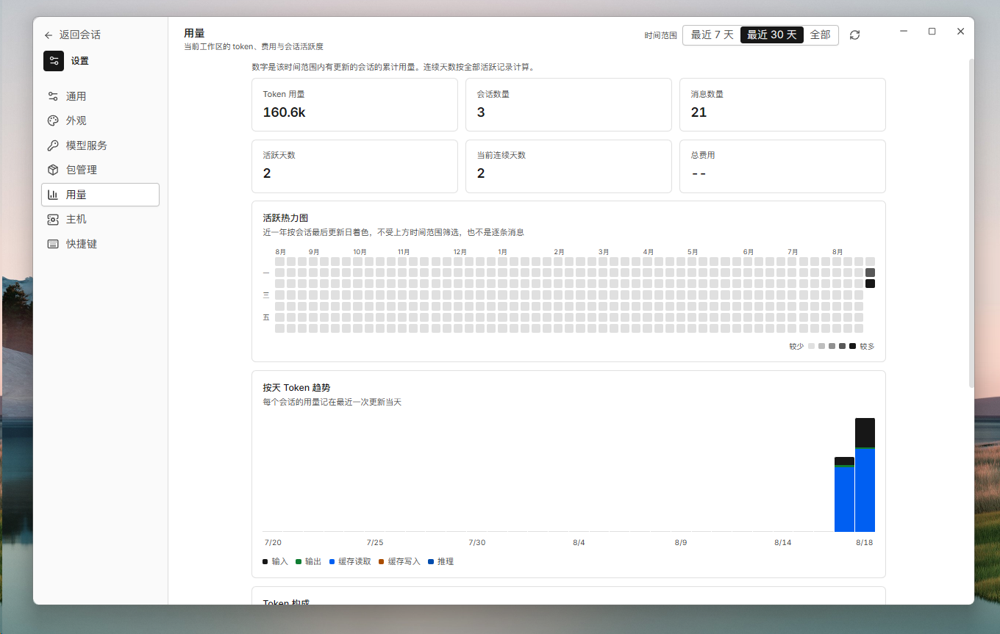
      <br><sub>Usage dashboard</sub>
    </td>
  </tr>
</table>

## Download

Grab the installer for your platform from the [latest release](https://github.com/Skitre/PiDeck/releases):

| Platform | File |
|---|---|
| Windows 11 x64 | `PiDeck_<version>_x64-setup.exe` |
| macOS Apple Silicon | `PiDeck_<version>_aarch64.dmg` |
| macOS Intel | `PiDeck_<version>_x64.dmg` |

These downloads are early-access development candidates rather than accepted,
platform-certified public releases. PiDeck checks for updates automatically and
installs them in place.

> **Early-access builds.** Windows candidates do not yet carry an accepted
> Authenticode signature; macOS candidates may use an ad-hoc signature instead
> of Developer ID signing and notarization. SmartScreen or Gatekeeper can
> therefore warn or block the app. Release status, verification boundaries,
> and signing progress are tracked in the
> [release notes](./docs/operations/release.md).

## Works with the Pi CLI — but doesn't need it

PiDeck bundles the Pi SDK (currently `0.84.2`) and its own Node runtime, so
it runs standalone — no global `pi` executable or Node installation required.
The Windows build bundles Git as well.

If you also use the Pi CLI, both share `~/.pi/agent` (authentication, model
settings, and user-scope packages) and each workspace's `.pi` directory
(sessions and history). PiDeck does not load or manage project-local packages
from `<workspace>/.pi`. Keep the CLI version close to PiDeck's pinned SDK
version, and avoid editing the same session from both apps at once.

## Build from source

Requirements: [Node](./.node-version) ≥ 22.19.0, pnpm 9.15.0, Rust stable, and
the [Tauri 2 prerequisites](https://v2.tauri.app/start/prerequisites/). See the
[development guide](./docs/operations/development.md) for one-command toolchain
setup on Windows and macOS.

```bash
pnpm install --frozen-lockfile
pnpm build
pnpm --filter @pideck/desktop run tauri:dev
```

The first launch compiles the Tauri application and may take several minutes;
later launches reuse the build cache. To verify a checkout, run
`pnpm verify:quick` (docs, types, JS/TS tests) or `pnpm verify:p0` (adds the
production build and Rust tests). Native installers are built with
`pnpm package:release`.

## Security

PiDeck loads only user-scope packages from `~/.pi/agent`. Opening a
workspace does not run `<workspace>/.pi/extensions`. Only install packages
you trust. Provider credentials, settings, and sessions are user data under
`~/.pi/agent` — never commit them to a repository.

## Project layout

| Path | Role |
|---|---|
| `apps/desktop` | React/Vite interface and Tauri 2 desktop host |
| `packages/protocol` | Typed Rust/Host/UI process protocol |
| `packages/pi-host` | Node sidecar that owns the Pi SDK |
| `docs` | [Architecture](./docs/architecture/overview.md), [development](./docs/operations/development.md), and [release](./docs/operations/release.md) documentation |
| `scripts` | Verification, runtime staging, and packaging tools |

More in the [documentation index](./docs/README.md).

## License

MIT — see [LICENSE](./LICENSE) and [THIRD_PARTY_NOTICES.md](./THIRD_PARTY_NOTICES.md).

## Friends

- **[Linux DO](https://linux.do/)** — Learn AI? Visit Linux DO!
